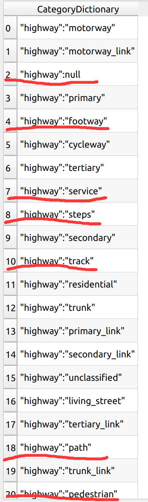
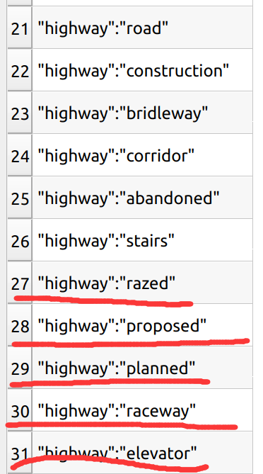

1. road data: 
- 1> download the osm data, which is much better than the shp data. https://download.bbbike.org/osm/bbbike/
- 2> convert the lines of osm data to geojson data.
- 3> roadDataConverter to conver the geojson to the format in ttk. save the point and lines and the property of the line.
- 4> use ttk pipline/ttk extract to filter road data based on the property: the final road network contians:  
 
